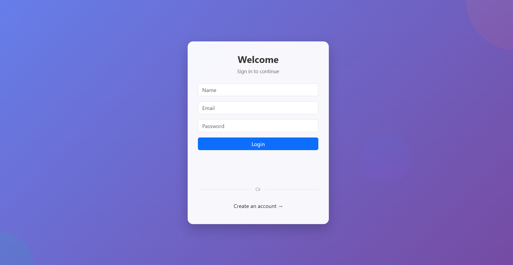
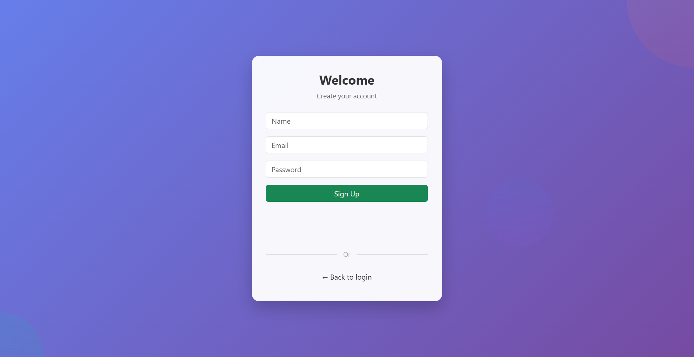
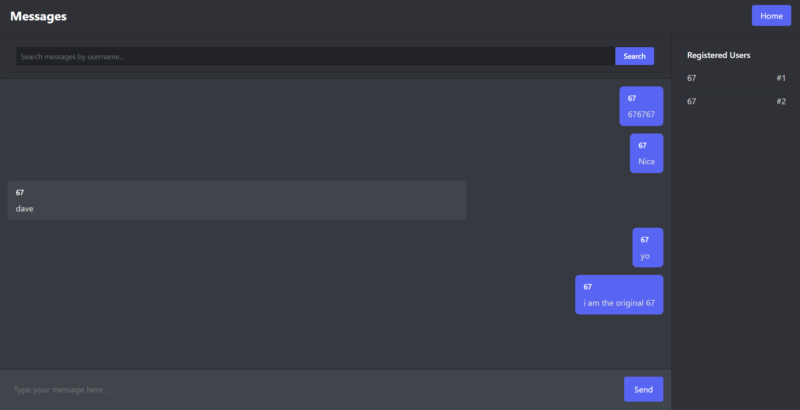

# Messaging app
A messaging app, which was made with React, Springboot and mySQL

---

## Overview
- A realtime messaging app, where you can chat to registered users to a global chat
- Learning full stack developement

---

## Features
- Sign Up + Login which sends data to backend
- Real-time messaging
- Search messages by username
- Responsive design 

---

### Frontend
- **React 19** (UI library)  
- **Vite 7** (development & build tool)  
- **React Router DOM 7** (client-side routing)  
- **Axios 1.12** (HTTP requests)  
- **Bootstrap 5.3** (styling & responsive layout)  

### Backend
- **Spring Boot 3.5** (application framework)  
- **Spring Boot Starter Web** (REST API)  
- **Spring Boot Starter Data JPA** (database access)  
- **MySQL Connector/J** (JDBC driver for MySQL)  
- **Spring Boot Docker Compose** (runtime support for Docker integration)  

### Database
- **MySQL**  

### Development Tools
- **Java 17**  
- **Maven** (build tool)  
- **ESLint 9** (linting for React code)  
- **@vitejs/plugin-react** (React integration with Vite)  

---

## Project Structure
/demo
├── src/main/java/... → Spring Boot backend code
├── src/main/resources
│ ├── static/ → React build output (after running npm run build)
│ └── application.properties
| └── application-prod.properties
| └── application-dev.properties
└── pom.xml → Maven config

/frontend
├── src/ → React components and logic (development code)
├── public/ → Static assets
├── package.json → Frontend dependencies
└── vite.config.js → Vite config


During development, you run React separately with npm run dev (on Vite).

For production, you run npm run build, copy the build output into /demo/src/main/resources/static/, and Spring Boot serves the frontend.

---

### Deployment
- Backend deployed on: render.com

- Frontend hosted on: render.com

- Database hosted on: railway.app

Live at: https://message-app-hphl.onrender.com/

## Screenshots


### Login Page


### Signup Page


### Chat Interface



---

## Setup Instructions

### 1. Clone the repository
```bash
git clone https://github.com/daveranola/message-app.git
cd message-app
```

### 2. Frontend
```bash
npm install
npm start
```

App uses a proxy to forward API requests to the backend.
Update your vite.config.js to match your local backend details if needed:
```js
// vite.config.js
import { defineConfig } from 'vite'
import react from '@vitejs/plugin-react'

export default defineConfig({
  plugins: [react()],
  server: {
    port: <your-reactdev-server>, // React dev server
    proxy: {
      '/<your-database-name>': { // must match your backend mapping
        target: 'http://localhost:8080',
        changeOrigin: true,
        secure: false,
      },
    },
  },
})
```

### 3. Backend
- Open demo/ folder in IDE
- Create a file called application-dev.properties inside:
```bash
demo/src/main/resources/
```
- Add local config:
```bash
spring.docker.compose.enabled=false

# Local MySQL
spring.datasource.url=jdbc:mysql://<host>:<port>/<your-database-name>
spring.datasource.username=<your-username>
spring.datasource.password=<your-password>
spring.datasource.driver-class-name=com.mysql.cj.jdbc.Driver

# JPA / Hibernate
spring.jpa.hibernate.ddl-auto=update
spring.jpa.database-platform=org.hibernate.dialect.MySQL8Dialect
spring.jpa.show-sql=true
```

- Run backend

### 4. Database (MySQL)
- Download MySQL
- Create local database:
```bash
CREATE DATABASE <your-database-name>;
```

### 5. Run app
- Run following command:
```bash
npm run build
```
- Go to your localhost e.g. localhost:3306